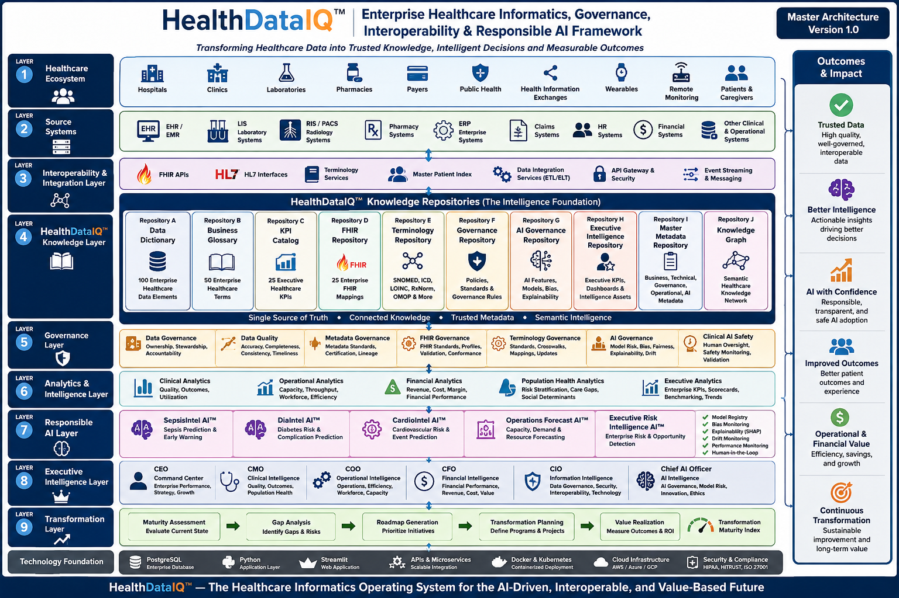

<div align="center">

# 🏥 HealthDataIQ™

## Enterprise Healthcare Informatics Operating System (HEOS)

### Transforming Governed Healthcare Data into Trusted Knowledge, Executive Intelligence, and Measurable Business Value


</div>

---

# Executive Summary

Healthcare organizations generate enormous volumes of clinical, operational, financial, and administrative data.

Yet many still struggle with fragmented governance, inconsistent business definitions, poor metadata visibility, siloed interoperability initiatives, uncontrolled AI adoption, and limited executive visibility into transformation outcomes.

**HealthDataIQ™** was developed as a consulting-grade **Enterprise Healthcare Informatics Operating System (HEOS)** demonstrating how governance, metadata, interoperability, responsible AI, executive intelligence, and digital transformation can operate as one integrated enterprise framework.

Its guiding philosophy is simple:

> **Governed Data → Trusted Information → Executive Intelligence → Business Value**

---

## 🌐 Streamlit Live Demo

https://healthdataiq-p97uqv8wcdmtopepgctywg.streamlit.app/

---

# 🏗 Enterprise Master Architecture

<p align="center">



</p>
 
---

# Business Challenge

Modern healthcare organizations commonly face:

## Governance Challenges

- Fragmented governance structures
- Weak stewardship
- Inconsistent ownership
- Poor accountability

## Metadata Challenges

- Limited metadata visibility
- Inconsistent business definitions
- Missing lineage
- Poor discoverability

## Data Challenges

- Variable data quality
- Multiple versions of truth
- Inconsistent KPIs
- Low trust in reporting

## Interoperability Challenges

- Siloed information systems
- Weak API governance
- Inconsistent FHIR implementation
- Poor terminology standardization

## AI Challenges

- Lack of governance
- Explainability concerns
- Bias monitoring limitations
- Model lifecycle risks

## Executive Challenges

- Limited transformation visibility
- Weak ROI measurement
- Disconnected initiatives
- Poor strategic alignment

---

# Strategic Vision

HealthDataIQ™ integrates:

- Enterprise Data Governance

- Metadata Management

- Data Quality

- FHIR Interoperability

- Terminology Services

- Responsible AI Governance

- Enterprise Architecture

- Executive Intelligence

- Digital Health Transformation

- Value Realization

into one unified Healthcare Informatics Operating System.

---

# Platform Components

## 📚 Knowledge Foundation

- Enterprise Data Dictionary

- Business Glossary

- KPI Catalog

- FHIR Repository

- Terminology Repository

- Metadata Repository

- Governance Repository

- AI Governance Repository

- Executive Intelligence Repository

- Healthcare Knowledge Graph

---

## 🛡 Governance Layer

- Data Governance

- Metadata Governance

- Data Quality Governance

- FHIR Governance

- Terminology Governance

- AI Governance

- Clinical AI Safety

---

## 📊 Analytics & Intelligence

- Clinical Analytics

- Operational Analytics

- Financial Analytics

- Population Health Analytics

- Executive Analytics

---

## 🤖 Responsible AI Layer

Demonstration modules include:

- SepsisIntel AI™

- DiaIntel AI™

- CardioIntel AI™

- Operations Forecast AI™

- Executive Risk Intelligence AI™

with enterprise controls including:

- Model Registry

- SHAP Explainability

- Bias Monitoring

- Drift Detection

- Human Oversight

---

## 👔 Executive Intelligence

Purpose-built executive dashboards for:

- CEO

- CMO

- COO

- CFO

- CIO

- Chief AI Officer

---

## 🚀 Transformation Layer

- Maturity Assessment

- Gap Analysis

- Strategic Roadmap

- Transformation Planning

- Value Realization

- Transformation Maturity Index

---

# Enterprise Operating Model

```
Healthcare Data

        ↓

Data Governance

        ↓

Metadata

        ↓

Data Quality

        ↓

Interoperability

        ↓

Responsible AI

        ↓

Executive Intelligence

        ↓

Digital Transformation

        ↓

Business Value
```

---

# Healthcare Informatics Maturity Framework

| Level | Classification |
|----------|-------------------------|
| Level 1 | Fragmented |
| Level 2 | Managed |
| Level 3 | Connected |
| Level 4 | Intelligent |
| Level 5 | Transformational |

---
# Repository Structure

HealthDataIQ/
│
├── app.py
├── requirements.txt
├── LICENSE
├── README.md
├── .gitignore
│
├── assets/
│   ├── styles.py
│   ├── logo.png
│   └── ...
│
├── pages/
│   ├── 01_Executive_Assessment.py
│   ├── 02_Data_Dictionary.py
│   ├── 03_Business_Glossary.py
│   ├── ...
│   ├── 25_Value_Realization_Office.py
│   └── 26_Executive_Insights_Recommendations_Conclusion.py
│
├── docs/
│   ├── HealthDataIQ_Executive_White_Paper.pdf
│   ├── HealthDataIQ_Case_Study.pdf
│   └── images/
│       └── healthdataiq_master_architecture.png
│
└── data/
    └── ...

# Key Capabilities

✅ Enterprise Data Governance

✅ Metadata Management

✅ Business Glossary

✅ Data Dictionary

✅ Data Quality Monitoring

✅ FHIR Readiness

✅ Terminology Services

✅ Responsible AI Governance

✅ Executive Intelligence

✅ Digital Health Transformation

✅ Value Realization

---

# Key Lessons

Building HealthDataIQ™ reinforced several important principles:

1. Governance is the foundation of enterprise intelligence.

2. Metadata precedes trustworthy analytics.

3. Metadata precedes trustworthy AI.

4. Interoperability is a strategic capability.

5. Responsible AI must be governed before deployment.

6. Executive intelligence requires integrated governance, metadata, interoperability, and AI.

7. Digital transformation succeeds when value realization is continuously measured.

---

# Strategic Positioning

HealthDataIQ™ is **not an Electronic Health Record (EHR).**

It is **not a Business Intelligence dashboard.**

It is **not an AI model.**

It is an **Enterprise Healthcare Informatics Operating System (HEOS)** that unifies governance, metadata, interoperability, responsible AI, executive intelligence, and transformation management into a consulting-grade strategic framework.

---

# Author

## Samuel Israel, MD

**Master of Information Technology (AI Specialization)**

Healthcare AI • Clinical Informatics • Responsible AI Governance • Digital Health Transformation • Healthcare Interoperability • Executive Intelligence • Enterprise Healthcare Architecture

### Career Vision

Healthcare AI Specialist

→ Clinical Informatics Specialist

→ Healthcare AI Governance Lead

→ Digital Health Transformation Consultant

→ Enterprise Healthcare Intelligence Leader

→ Chief Data & AI Officer (Healthcare)

---

# License

MIT License

---

## ⭐ If you found this project valuable, please consider starring the repository.
